# Multi-agent PubChem → filter → pocket → dock → optimize workflow

## Context

Implement the project under **[cheminformatics_testing](e:\Github\CursorTesting\cheminformatics_testing)** (create this directory as the repo root). Use **Python 3.11+**. Prefer **RDKit** for graph/SMILES logic and **Open Babel** for format interconversion, protonation at target pH, and tasks where OB is the standard tool—document the split in `README` so contributors stay consistent.

**Open-source posture**: use a **permissive license** (MIT or Apache-2.0), depend only on **open-licensed** tools (GNINA, fpocket, OpenMM, PDBFixer, Vina, RDKit, Open Babel), and include a **THIRD_PARTY_NOTICES** or license appendix for binaries (fpocket, GNINA). Avoid PyRosetta and commercial force fields unless explicitly optional.

**Resource posture**: treat **low peak RAM** and **stable hosts** as first-class requirements. Prefer **more wall time with smaller batches** over loading entire hit lists or docking queues into memory at once. Defaults should run safely on **shared laptops and lab workstations**; power users raise caps explicitly. See **Resource efficiency** under Robustness layers.

### Phased view (same workflow, coarser lanes)

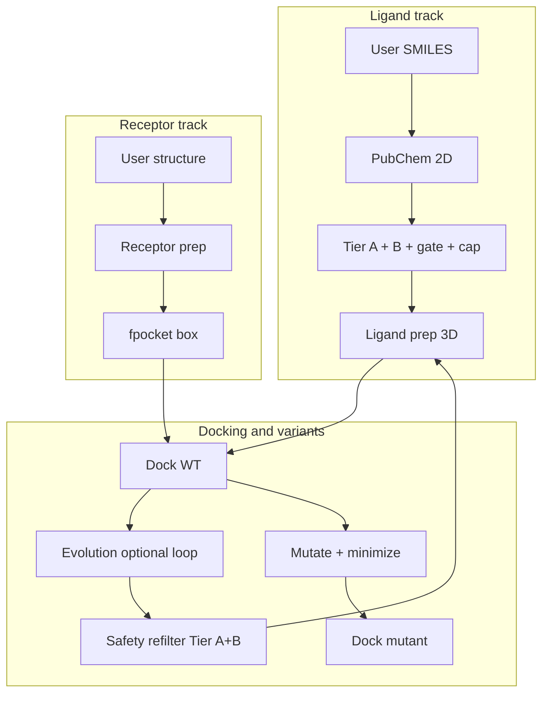

### Tooling map (who owns what)

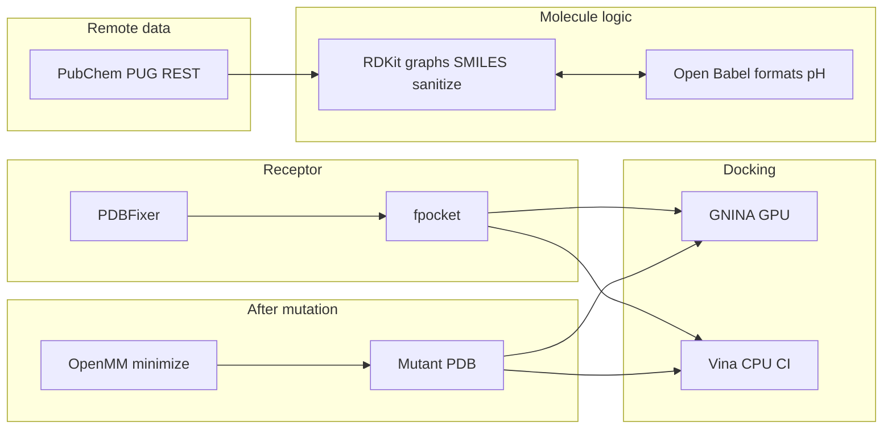

## High-level architecture

Use **LangGraph** (or equivalent) with **strict pipeline ordering** so expensive steps run only on compounds that pass earlier gates.

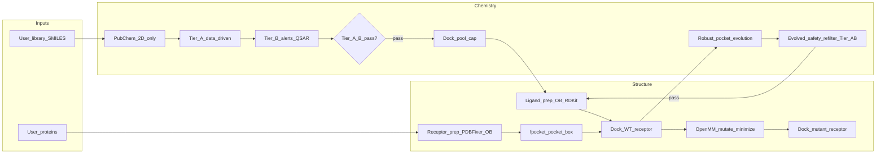

### Sequence: wild-type dock → mutation → mutant redock

```mermaid
sequenceDiagram
  autonumber
  participant LP as Ligand_prep
  participant WT as WT_receptor + box
  participant Dock as DockingBackend
  participant Evo as Evolution_optional
  participant OM as OpenMM_mutate
  participant MT as Mutant_receptor
  LP->>Dock: Prepared ligands
  WT->>Dock: WT pass poses_wt
  Dock-->>Evo: Scores for fitness
  Note over Dock,Evo: Evolution loop uses WT scores; refilter before re_prep
  WT->>OM: Binding_site residues
  OM->>MT: Minimized mutant PDB
  MT->>Dock: Mutant pass poses_mutant
  Dock-->>Dock: Delta_table WT vs mutant
```

**Critical rules**

- **No docking** until **Tier A and Tier B** complete on the compound set; the **gate** node represents the hard filter (only `pass` rows continue).
- **Dock pool size**: config chooses **one** mode—**either** `max_compounds_to_dock` **or** `top_n_by_2d_score` (rank survivors by 2D similarity, then take top N)—**not** a chained “divide by both” rule. After filters, expect on the order of **≤ ~1000** compounds (or fewer) eligible for docking; tune the chosen cap accordingly.
- **WT vs mutant**: first docking pass uses the **wild-type** prepared receptor; after **OpenMM** mutation and minimization, a **separate mutant-receptor docking pass** produces poses/scores for Δ comparisons.
- **Evolved compounds**: every batch that will be prepped/docked again must pass **Evolved_safety_refilter_Tier_AB** (same Tier A+B rules and provenance as the initial library pass); failures are dropped or logged with rationale—**no** silent bypass.
- **Resources**: keep **parallel docking**, **HTTP**, and **in-memory working sets** within configured bounds so the OS is unlikely to thrash or OOM; heavy work stays in **subprocesses** where practical (see **Resource efficiency**).

### Pipeline artifacts (run directory)

Persist **pertinent outputs at each stage** under a single run root (e.g. `runs/<run_id>/`) so checkpoints, audit, and debugging stay straightforward. Use **stable relative paths** and append **step version or config hash** inside `run_manifest.json` rather than encoding them in every filename.

| Area | Suggested paths / files | Contents |
|------|-------------------------|----------|
| Run root | `run_manifest.json` | Git commit, env/tool versions, CLI args, seeds, config snapshot, step schema versions |
| Logging | `logs/steps.jsonl` (or one file per step) | Structured lines: `step`, `duration_s`, counts, exit codes, stderr paths |
| PubChem | `pubchem/hits.parquet` (or `.csv`) | CIDs, SMILES, similarity, query id, cache keys |
| Tier A / B (initial) | `filters/tier_a_rationale.parquet`, `filters/tier_b_rationale.parquet` | Per-compound pass/fail, scores, provenance columns |
| Gate + cap | `filters/dock_pool.parquet` | Final SMILES/id list after gate; which cap mode was applied |
| Ligand prep | `ligands/prepared_sdf/` or `ligands/prepared_mol2/` | 3D inputs for docking; prep log per batch |
| Receptor / fpocket | `structure/receptor_prepared.pdb`, `structure/fpocket_raw/`, `structure/pocket_spec.json` | Prepared WT PDB, fpocket stdout artifacts, parsed box/center |
| Dock WT | `poses/wt/` | GNINA/Vina poses, scores table `poses/wt/docking_scores.parquet`, backend log |
| Dock mutant | `poses/mutant/` | Same layout for mutant receptor after `OpenMM_mutate_minimize` |
| Mutations | `structure/mutant_receptor.pdb`, `mutations/residue_map.json` | Minimized mutant structure, requested mutations |
| Evolution | `evolution/generations.parquet`, `evolution/best_lineage.parquet` | Per-generation SMILES, parents, fitness, seeds |
| Evolved refilter | `filters/evolved_tier_a_rationale.parquet`, `filters/evolved_tier_b_rationale.parquet` | Same schema as initial filters; ties evolved ids to rationale |
| Checkpoints | `checkpoints/<step_name>.json` (or LangGraph store) | Resumable state after heavy steps |
| Ground truth | `validation/ground_truth_report.json` | Per-case 2D + docking metrics, pass/fail, tool versions (see **§9**) |
| Human QA plots | `plots/*.png` (optional) | Bar/histogram/scatter figures from **Human review plots** below; not required for headless CI |

On workflow completion, optionally write `summary/summary.json` (counts per stage, best scores, paths to key artifacts) for quick human review.

```mermaid
flowchart TB
  subgraph artifacts [Run directory — artifact families]
    M[run_manifest.json]
    LG[logs/steps.jsonl]
    PC[pubchem/hits.*]
    F1[filters/tier_a_b + dock_pool.*]
    ST[structure/receptor + fpocket + pocket_spec.*]
    PWT[poses/wt/*]
    PMT[poses/mutant/*]
    EV[evolution/*]
    EF[filters/evolved_tier_*.*]
    CK[checkpoints/*]
    GT[validation/ground_truth_report.json]
    PL2[plots/*.png]
    SM[summary/summary.json]
  end
  M --- LG
  LG --- PC
  PC --- F1
  F1 --- ST
  ST --- PWT
  PWT --- PMT
  PMT --- EV
  EV --- EF
  EF --- CK
  CK --- GT
  GT --- PL2
  PL2 --- SM
```

The diagram is **logical grouping only** (not a strict dependency chain); actual writes occur as each pipeline step completes. **`validation/*`** is also emitted by the **ground-truth suite** (§9), which may run outside a full production graph.

### Run directory tree (compact)

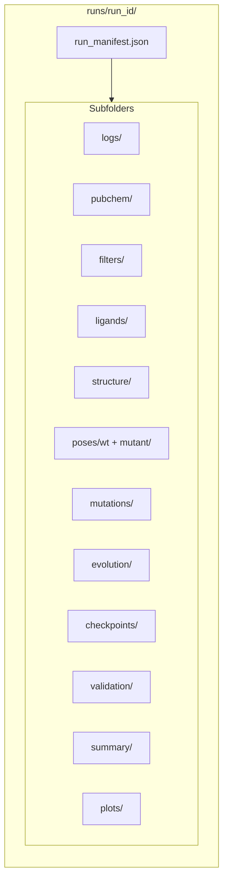

### Human review: when to plot what

Long runs produce tables that are hard to scan as raw Parquet/JSON. **Bar charts, histograms, and scatter plots** help humans spot funnels that are too tight, bad docking tails, unstable evolution, or ground-truth regressions. Use **`pandas` + `matplotlib`** (optional **`seaborn`**) so the stack stays conda-friendly next to RDKit. **Do not** load full Parquet files for plotting when **`read_parquet(columns=[...], ...)`** or aggregates suffice (**Resource efficiency**).

| Stage | Artifact(s) | What a human should sanity-check |
|-------|-------------|-----------------------------------|
| After PubChem | `pubchem/hits.parquet` | Hits per query SMILES; similarity distribution (did the search return enough breadth?) |
| After Tier A/B | `filters/tier_*_rationale.parquet` | Which rules drive failure; pass rate; initial vs evolved refilter comparison |
| Dock pool | `filters/dock_pool.parquet` | Size vs cap; overlap with similarity ranks |
| After docking | `poses/wt/docking_scores.parquet` (and mutant) | Score distribution; outliers; sign convention (GNINA vs Vina) |
| WT vs mutant | merged WT + mutant score tables | Δscore distribution; compounds that flip sign |
| Evolution | `evolution/generations.parquet` | Best/mean fitness vs generation; diversity proxy if logged |
| Safety refilter | `filters/evolved_tier_*.parquet` | Attrition rate per generation; same rule IDs as initial filters |
| Run health | `logs/steps.jsonl` | Wall time per step; retries/failures |
| Ground truth | `validation/ground_truth_report.json` | Pass/fail per benchmark case after refactors |
| One-glance | `summary/summary.json` | Funnel counts if the workflow writes them here |

**Deliverable in-repo**: e.g. `src/workflow/reporting/plots.py` and CLI `workflow plot --run <run_dir>` **or** a small **notebook** under `notebooks/run_review.ipynb` (gitignored outputs). Plots should write to `runs/<run_id>/plots/` or a user-chosen path so they ship with the audit trail.

#### Example: funnel counts (bar chart)

Assumes `summary/summary.json` defines numeric counts per stage (implement these keys in the scaffold). Fallback: derive counts from table lengths.

```python
from pathlib import Path
import json
import matplotlib.pyplot as plt

def plot_funnel_bar(run_dir: Path, out_path: Path | None = None) -> None:
    summary_p = run_dir / "summary" / "summary.json"
    if summary_p.exists():
        s = json.loads(summary_p.read_text())
        labels = ["PubChem hits", "After Tier A+B", "Dock pool", "Docked WT"]
        keys = ["n_pubchem_hits", "n_after_tier_ab", "n_dock_pool", "n_docked_wt"]
        values = [s.get(k, 0) for k in keys]
    else:
        import pandas as pd
        labels = ["PubChem hits", "After Tier A+B", "Dock pool", "Docked WT"]
        values = [
            len(pd.read_parquet(run_dir / "pubchem" / "hits.parquet")),
            # passed_tier_ab: adjust column name to your schema
            len(pd.read_parquet(run_dir / "filters" / "tier_b_rationale.parquet").query("passed_tier_ab == True")),
            len(pd.read_parquet(run_dir / "filters" / "dock_pool.parquet")),
            len(pd.read_parquet(run_dir / "poses" / "wt" / "docking_scores.parquet")),
        ]
    fig, ax = plt.subplots(figsize=(8, 4))
    ax.bar(labels, values, color="steelblue")
    ax.set_ylabel("Compound count")
    ax.set_title("Pipeline funnel")
    plt.xticks(rotation=15, ha="right")
    fig.tight_layout()
    outp = out_path or (run_dir / "plots" / "funnel.png")
    outp.parent.mkdir(parents=True, exist_ok=True)
    fig.savefig(outp, dpi=150)
    plt.close(fig)
```

#### Example: Tier B rule failure rate (horizontal bar)

Assumes one boolean column per rule, e.g. `rule_ecotox_proxy_pass` (adjust names to match your wide rationale table).

```python
from pathlib import Path
import pandas as pd
import matplotlib.pyplot as plt

def plot_tier_b_failure_rates(run_dir: Path, out_path: Path | None = None) -> None:
    tb = pd.read_parquet(run_dir / "filters" / "tier_b_rationale.parquet")
    pass_cols = [c for c in tb.columns if c.endswith("_pass") and not c.startswith("passed_tier")]
    if not pass_cols:
        raise ValueError("No *_pass rule columns found; align with FilterResult schema")
    fail_rate = (~tb[pass_cols]).mean().sort_values(ascending=True)
    fail_rate.index = [c.replace("_pass", "") for c in fail_rate.index]
    fig, ax = plt.subplots(figsize=(8, max(3, len(fail_rate) * 0.25)))
    fail_rate.plot.barh(ax=ax, color="coral")
    ax.set_xlabel("Fraction failed (per compound)")
    ax.set_title("Tier B rules — failure rate")
    fig.tight_layout()
    outp = out_path or (run_dir / "plots" / "tier_b_failures.png")
    outp.parent.mkdir(parents=True, exist_ok=True)
    fig.savefig(outp, dpi=150)
    plt.close(fig)
```

#### Example: PubChem similarity distribution (histogram)

```python
from pathlib import Path
import pandas as pd
import matplotlib.pyplot as plt

def plot_similarity_hist(run_dir: Path, score_col: str = "tanimoto_similarity") -> None:
    hits = pd.read_parquet(run_dir / "pubchem" / "hits.parquet")
    fig, ax = plt.subplots(figsize=(7, 4))
    ax.hist(hits[score_col], bins=40, color="seagreen", edgecolor="white")
    ax.set_xlabel(score_col)
    ax.set_ylabel("Count")
    ax.set_title("PubChem 2D similarity (all hits)")
    fig.tight_layout()
    outp = run_dir / "plots" / "similarity_hist.png"
    outp.parent.mkdir(parents=True, exist_ok=True)
    fig.savefig(outp, dpi=150)
    plt.close(fig)
```

#### Example: docking score distribution + similarity scatter

**Important**: GNINA and Vina use different score conventions; plot **one backend per figure** and label units in the title.

```python
from pathlib import Path
import pandas as pd
import matplotlib.pyplot as plt

def plot_dock_score_hist(run_dir: Path, score_col: str = "score") -> None:
    wt = pd.read_parquet(run_dir / "poses" / "wt" / "docking_scores.parquet")
    fig, ax = plt.subplots(figsize=(7, 4))
    ax.hist(wt[score_col], bins=50, color="slateblue", edgecolor="white")
    ax.set_xlabel(score_col)
    ax.set_ylabel("Count")
    ax.set_title("WT docking scores")
    fig.tight_layout()
    (run_dir / "plots").mkdir(parents=True, exist_ok=True)
    fig.savefig(run_dir / "plots" / "dock_wt_hist.png", dpi=150)
    plt.close(fig)

def plot_similarity_vs_score(run_dir: Path, score_col: str = "score", sim_col: str = "tanimoto_similarity") -> None:
    hits = pd.read_parquet(run_dir / "pubchem" / "hits.parquet")
    scores = pd.read_parquet(run_dir / "poses" / "wt" / "docking_scores.parquet")
    key = "compound_id"
    m = hits.merge(scores, on=key, how="inner")
    fig, ax = plt.subplots(figsize=(6, 6))
    ax.scatter(m[sim_col], m[score_col], alpha=0.35, s=12)
    ax.set_xlabel(sim_col)
    ax.set_ylabel(score_col)
    ax.set_title("2D similarity vs docking score (WT)")
    fig.tight_layout()
    fig.savefig(run_dir / "plots" / "similarity_vs_dock.png", dpi=150)
    plt.close(fig)
```

#### Example: WT vs mutant Δscore (histogram)

```python
from pathlib import Path
import pandas as pd
import matplotlib.pyplot as plt

def plot_delta_scores(run_dir: Path, key: str = "compound_id", score_col: str = "score") -> None:
    wt = pd.read_parquet(run_dir / "poses" / "wt" / "docking_scores.parquet")
    mt = pd.read_parquet(run_dir / "poses" / "mutant" / "docking_scores.parquet")
    merged = wt[[key, score_col]].merge(
        mt[[key, score_col]], on=key, suffixes=("_wt", "_mut")
    )
    merged["delta"] = merged[f"{score_col}_mut"] - merged[f"{score_col}_wt"]
    fig, ax = plt.subplots(figsize=(7, 4))
    ax.hist(merged["delta"], bins=40, color="teal", edgecolor="white")
    ax.set_xlabel("Δ score (mutant − WT)")
    ax.set_ylabel("Count")
    ax.set_title("Distribution of docking score change after mutation")
    fig.tight_layout()
    (run_dir / "plots").mkdir(parents=True, exist_ok=True)
    fig.savefig(run_dir / "plots" / "delta_score_hist.png", dpi=150)
    plt.close(fig)
```

#### Example: evolution — best fitness per generation (line plot)

```python
from pathlib import Path
import pandas as pd
import matplotlib.pyplot as plt

def plot_evolution_progress(run_dir: Path, gen_col: str = "generation", fit_col: str = "fitness") -> None:
    gen = pd.read_parquet(run_dir / "evolution" / "generations.parquet")
    best = gen.groupby(gen_col, sort=True)[fit_col].max()
    fig, ax = plt.subplots(figsize=(7, 4))
    best.plot(ax=ax, marker="o", color="darkorange")
    ax.set_xlabel(gen_col)
    ax.set_ylabel(f"Best {fit_col}")
    ax.set_title("Evolution — best fitness by generation")
    fig.tight_layout()
    (run_dir / "plots").mkdir(parents=True, exist_ok=True)
    fig.savefig(run_dir / "plots" / "evolution_best.png", dpi=150)
    plt.close(fig)
```

#### Example: step runtimes from structured logs (bar chart)

```python
from pathlib import Path
import json
import pandas as pd
import matplotlib.pyplot as plt

def plot_step_durations(run_dir: Path, log_glob: str = "logs/steps.jsonl") -> None:
    log_files = list(run_dir.glob(log_glob))
    if not log_files:
        return
    rows = []
    for fp in log_files:
        for line in fp.read_text().splitlines():
            if line.strip():
                rows.append(json.loads(line))
    df = pd.DataFrame(rows)
    dur = df.groupby("step")["duration_s"].sum().sort_values(ascending=True)
    fig, ax = plt.subplots(figsize=(8, max(3, len(dur) * 0.3)))
    dur.plot.barh(ax=ax, color="gray")
    ax.set_xlabel("Total duration (s)")
    ax.set_title("Where time went (this run)")
    fig.tight_layout()
    (run_dir / "plots").mkdir(parents=True, exist_ok=True)
    fig.savefig(run_dir / "plots" / "step_durations.png", dpi=150)
    plt.close(fig)
```

#### Example: ground-truth regression summary (bar chart)

```python
from pathlib import Path
import json
import pandas as pd
import matplotlib.pyplot as plt

def plot_ground_truth_summary(run_dir: Path) -> None:
    p = run_dir / "validation" / "ground_truth_report.json"
    rep = json.loads(p.read_text())
    df = pd.DataFrame(rep["cases"])
    vc = df["passed"].map({True: "pass", False: "fail"}).value_counts()
    vc = vc.reindex(["pass", "fail"]).fillna(0).astype(int)
    fig, ax = plt.subplots(figsize=(4, 4))
    vc.plot.bar(ax=ax, color=["green", "red"])
    ax.set_xticklabels(vc.index, rotation=0)
    ax.set_ylabel("Benchmark cases")
    ax.set_title("Ground truth suite")
    fig.tight_layout()
    (run_dir / "plots").mkdir(parents=True, exist_ok=True)
    fig.savefig(run_dir / "plots" / "ground_truth_pass_fail.png", dpi=150)
    plt.close(fig)
```

**Schema note**: Column names such as `compound_id`, `tanimoto_similarity`, `passed_tier_ab`, and `ground_truth_report.json` → `{"cases": [{"case_id", "passed", ...}]}` should be **fixed in Pydantic models** and mirrored in these plotting helpers so notebooks do not rot.

## Robustness layers (architecture-level additions)

These sit **orthogonal** to the chemistry graph: they make long, heterogeneous pipelines easier to trust, resume, and debug.

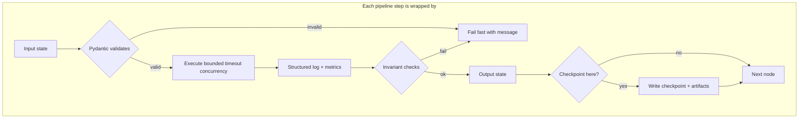

1. **Contract validation between steps** — Define a small set of **versioned Pydantic models** for each stage output (e.g. `HitList`, `FilterResult`, `PocketSpec`, `DockBatchResult`). The orchestrator **refuses** to pass malformed state to the next node. Catches silent column renames, empty SMILES, or wrong protein IDs early.

2. **Checkpointing and resume** — After **PubChem merge**, **Tier A+B**, **dock pool materialization**, **fpocket**, **WT docking**, **mutant docking**, and **evolution generations** (as configured), persist serialized state (or LangGraph checkpointer) to disk under a **run directory**. Re-runs use `--resume` or content hashes to skip completed steps. Pairs naturally with idempotent caching (already in §11).

3. **Structured observability** — **Structured logs** (JSON lines or equivalent) per step: `step`, `duration_s`, `input_count`, `output_count`, `exit_code`, optional **OpenTelemetry** spans later. Makes it obvious *where* a 6-hour run failed and whether partial outputs are trustworthy.

4. **Timeouts, retries, and backpressure** — Per-step **wall-clock timeouts** (especially external APIs and subprocesses). **Bounded concurrency** for PubChem/ChEMBL (avoid thundering herd). **Retry with jitter** only for idempotent reads. Docking queue with **max parallel** jobs to cap **GPU VRAM and host RAM** (each concurrent job loads receptor + ligand + engine overhead).

5. **Invariant checks (“sanity gates”)** — Lightweight assertions between nodes: e.g. after the dock pool is built, `len(dock_list)` respects the **single** active cap (`max_compounds_to_dock` **or** `top_n_by_2d_score`); after evolved refilter, no evolved id in the dock queue lacks `passed_tier_ab`; after fpocket, box volume within bounds and center inside protein extent; after docking, all scores finite and pose files exist. Fail fast with **actionable messages**.

6. **Dry-run and degradation profiles** — **`--dry-run`**: validate config, resolve inputs, print planned counts and costs, optionally run through Tier A+B with **no** docking. **`--profile ci`**: tiny caps and CPU-only backend. Documented **fallback**: GNINA missing → Vina with **explicit log line** (not silent).

7. **Subprocess and path hygiene** — Wrap **fpocket**, **GNINA**, **obabel** via a thin runner: allowlisted arguments, no shell=True, resolved paths under the run directory, capture stdout/stderr to log files. Reduces whole classes of “works on my machine” and injection issues.

8. **Input provenance and deduplication** — Canonicalize SMILES (RDKit) **before** similarity and filters; track **lineage** (query library member → PubChem hit → filter outcome) in one table so evolution and audits do not double-count or lose parent links.

### Resource efficiency (RAM-first, host-safe)

The workflow is **compute-heavy** by nature (docking, OpenMM), but the **Python orchestration layer** should stay **lean**: avoid unnecessary materialization of large tables, unbounded lists of RDKit molecules, or fork bombs of concurrent GPU jobs.

**Config knobs** (document sane defaults in `example.yaml`; scale up only when RAM/VRAM are known sufficient):

| Knob | Purpose |
|------|---------|
| `max_parallel_http` | PubChem / ChEMBL / similar API concurrency |
| `max_parallel_docks` | Concurrent GNINA/Vina subprocesses (primary RAM/VRAM lever) |
| `filter_chunk_size` / `tier_batch_size` | Process Tier A/B rows in chunks; append to Parquet incrementally |
| `pubchem_page_or_batch_limit` | Bound responses merged in memory before spill to disk |
| `ligand_prep_batch_size` | Conformer generation and OB calls in batches |
| `evolution_eval_batch_size` | Offspring evaluated per wave without holding all poses in memory |
| `max_rdkit_mols_in_memory` | Soft guard in tight loops (optional) |

**I/O discipline**

- Prefer **chunked reads/writes** for large Parquet/CSV (e.g. **PyArrow** `Scanner` / `iter_batches`, or pandas `chunksize` where appropriate). **Append** filter rationale to partitioned or batched files instead of one giant in-memory DataFrame.
- After a stage completes, **drop** large intermediate objects and avoid keeping prior-stage tables attached to LangGraph state if not needed downstream (persist paths, reload columns on demand).
- **Reporting/plots**: select **columns** explicitly; **downsample** scatter points; call **`plt.close(fig)`** (already in examples) so GUI backends do not retain buffers.

**Subprocess isolation**

- Run **GNINA, Vina, fpocket, obabel** as **separate processes** with a **bounded worker pool**. If a dock job exhausts memory, the OS typically kills the **child** first; the orchestrator can record failure and continue or backoff—better than taking down the whole Python driver.

**Evolution**

- Bound **population × offspring** processed concurrently; dock **fitness evaluation** in batches aligned with `max_parallel_docks`.
- Do not accumulate **all generations** of full pose files in RAM; scores and best SMILES paths on disk suffice for lineage.

**OpenMM / PDBFixer**

- One receptor minimization at a time per process unless profiling shows safe parallelism; document **single-flight** default for mutation+minimize.

**Containers and shared machines**

- Dockerfile and README: recommend **`docker run --memory`** / **`--cpus`** (or Compose limits) so the container cannot starve the host.
- Optional: **`psutil`** (or similar) to read **available RAM** before launching a large batch and to **log a warning** when headroom is low—fail fast with a clear message rather than ambiguous swap death.

**Testing**

- CI stays tiny by design. Optional **dev-only** profiling (**`memray`**, **`tracemalloc`**) on representative runs to catch regressions in peak RSS—do not block default CI on heavy memory tests.

Section 11 (run manifest, caching, fail-loud) **complements** this list; keep both.

## 1. Chemicals of interest and PubChem (2D only)

- **Input**: CSV/SDF with SMILES (+ optional names/CIDs).
- **2D similarity**: PubChem PUG-REST `fastsimilarity_2d` (or equivalent documented endpoint), configurable Tanimoto threshold, caching and polite concurrency per [PubChem programmatic access](https://pubchem.ncbi.nlm.nih.gov/docs/programmatic-access). **Memory**: merge hits **incrementally** to disk-backed tables; do not hold unbounded CID lists in RAM (see **Resource efficiency**).
- **Removed**: 3D chemical similarity search—do not implement shape/conformer similarity in the search phase.

Deliverables: `pubchem` client module, structured hits (CID, SMILES, similarity, query id). **Regression**: exercised against **§9** ground-truth ligands (mocked PubChem fixtures in CI).

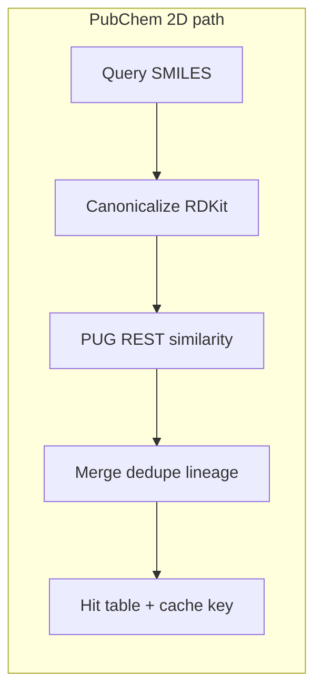

## 2. Herbicide-oriented filtering: Tier A + Tier B (both required)

Treat **Tier A** and **Tier B** as **mandatory stages** in the default profile (each can still expose sub-rules as YAML toggles, but the plan assumes both run unless the user explicitly opts into a “research/dev” mode in config).

- **Tier A (data-driven)**: ChEMBL (and similar) annotations for bioactivity/toxicity/ecotoxicity proxies; EPA ECOTOX or related mappings where feasible for non-target vs herbicide-relevant endpoints. Every rule writes **provenance** (source, version, query, threshold, raw payload id). **Memory**: batch CIDs / API pages; stream results into rationale tables instead of retaining full JSON forests in RAM (**Resource efficiency**).
- **Tier B (structural / QSAR)**: RDKit **structural alerts** (document which alert sets), plus **only open, citable QSAR/toxicity models** if included—pinned versions, no undocumented black boxes. Fail-soft: if a model artifact is missing, **fail the run with a clear error** in strict mode or **skip that sub-rule with logged warning** in dev mode (config-driven).

**Outputs**: wide rationale table (per compound: pass/fail per rule, scores, citations). Downstream docking reads **only** `passed_tier_ab == true`. **Evolved** SMILES that re-enter the pipeline must produce the **same style** of Tier A+B rationale files under `filters/evolved_*` (see **Pipeline artifacts**) so safety review stays complete.

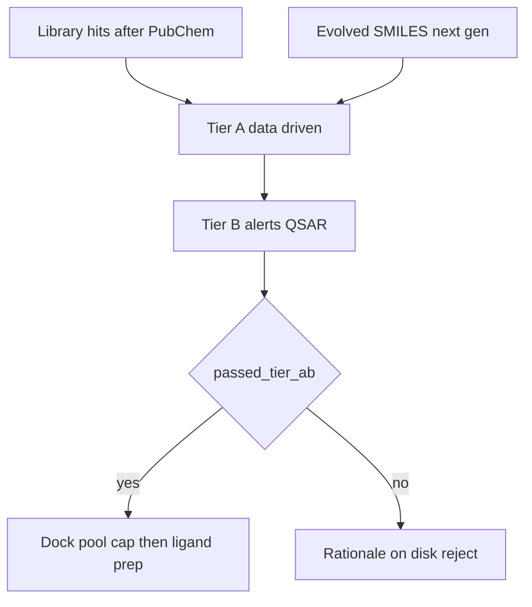

## 3. Proteins, mapping, and pocket prediction (fpocket)

- **Structures**: AlphaFold DB or PDB; user mmCIF/PDB override supported.
- **Receptor prep** (distinct from ligand prep in the graph): **PDBFixer** (missing atoms, alternates); **Open Babel** for protonation at configured pH. **RDKit** is for **ligand** graphs; receptor geometry stays in the PDB/mmCIF toolchain unless you explicitly document an exception.
- **Binding site**: **fpocket** as the **default** pocket predictor—parse fpocket output to derive **center + box dimensions** (or multiple pockets ranked by score; default: top pocket or merge rule documented). No routine human-in-the-loop PyMOL step.
- **Automation edge cases** (only places to pause or require config):
  - fpocket finds **no pocket** or **degenerate box** → stop with actionable error unless config supplies a **fallback numeric box** (optional override for power users).
- **Mapping**: explicit `pairs: [{protein_id, ligand_smiles_or_ids}]`; fpocket runs **per prepared receptor**, not per arbitrary cross-product.

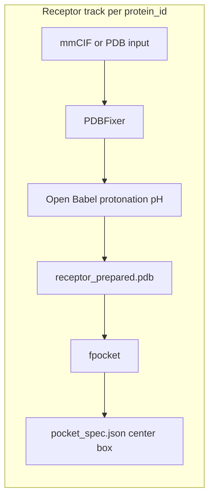

## 4. Docking and NVIDIA acceleration (minimal set)

- **GPU**: **GNINA** where CUDA is available; **CPU**: **AutoDock Vina** for CI and laptops.
- **Uniform** `DockingBackend` API; log versions and seeds in run metadata.
- **Wild-type vs mutant passes**: implement **two explicit docking modes** (or two orchestrated calls): **WT** against the prepared wild-type receptor, then **mutant** against the minimized mutant receptor after §5. Persist poses and score tables under separate directories (`poses/wt/`, `poses/mutant/`) so Δscore tables are unambiguous.
- **Volume control**: dock **only** compounds that passed Tier A+B (initial library) or Tier A+B **evolved refilter** (see §6). **Cap (choose one)**: set **either** `max_compounds_to_dock` **or** `top_n_by_2d_score` in config—**not** both as stacked filters unless you document a deliberate two-stage policy. Default mindset: **≤ ~1000** survivors (often fewer) in the docking pool after the gate and the chosen cap.
- **Parallelism**: **`max_parallel_docks`** (or equivalent) must default **conservatively** (often **1** on single-GPU laptops, **2–4** only when VRAM/RAM are documented). Queue the rest on disk-backed work lists.
- **Regression**: co-crystal **redock** and optional decoy-rank checks under **§9** use the same `DockingBackend` and prep stack as production (CPU/Vina in CI where applicable).

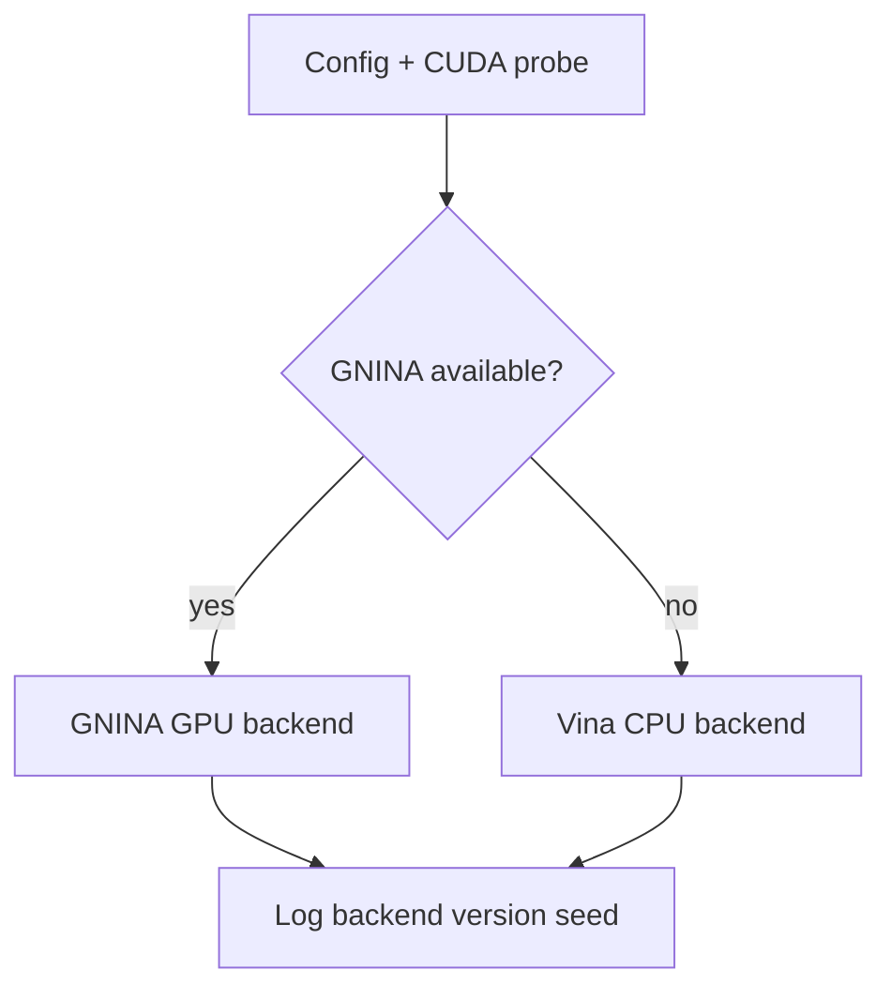

## 5. Protein mutations (OpenMM + PDBFixer)

- **Chosen stack**: **OpenMM** for energy minimization after mutation; **PDBFixer** (and/or documented OpenMM topology building) for introducing **single-point** mutations in binding-site residues (from fpocket residue lists or user residue list in config).
- **Flow**: mutate → minimize in implicit solvent (document force field, e.g. OpenMM `amber14-all.xml` + appropriate water model if used) → export **mutant** PDB → **mutant-receptor docking pass** (§4) on the same filtered ligands (or subset) → report **Δscore vs WT** using WT scores from the **first** docking pass.

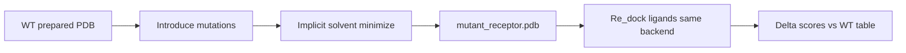

## 6. Robust evolution of chemistry “into” the pocket

Go beyond a minimal GA:

- **Representation**: **SELFIES** (or equivalent) for mutations with **RDKit validity repair** and rejection sampling instead of silently dropping invalid offspring.
- **Fitness**: primary = docking score (typically **WT** pass); **penalties** in the fitness function for structural risk (e.g. extreme logP, reactive motifs) are **not** a substitute for **hard** Tier A+B gates.
- **Mandatory safety refilter**: before any evolved SMILES returns to **ligand prep** and docking, re-run **full Tier A and Tier B** (same rules as the initial library unless config documents a stricter evolved profile). Drop or quarantine failures; write **evolved** rationale tables to disk (see **Pipeline artifacts**). This keeps regulatory-adjacent herbicide/safety logic consistent across generations.
- **Robustness**: **multi-seed** runs, **elitism**, **diversity** (Tanimoto crowding / niche), **generation caps**, and **convergence criteria** logged.
- **Resource-aware evolution**: fitness docking must respect the same **`max_parallel_docks`** and batching rules as production; avoid evaluating full offspring clouds simultaneously in memory.
- **Pocket awareness**: use **fpocket-derived pharmacophore hints** if available (e.g. distance constraints to key residues) as **soft filters** or docking box consistency checks between generations; document that this is heuristic, not FEP.
- **Reproducibility**: fixed seeds, logged operator probabilities, and archived best SMILES per generation.

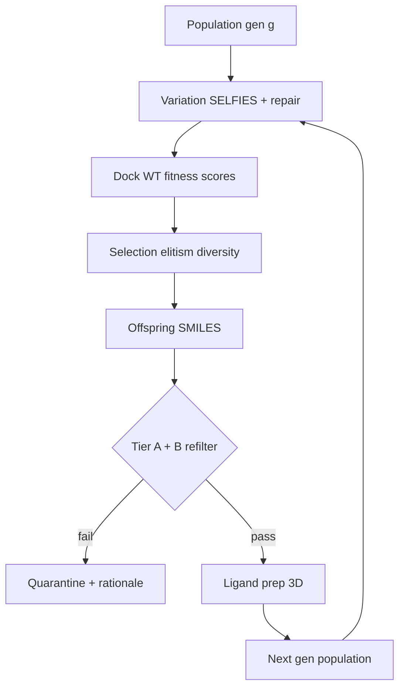

Optional later: open generative models (e.g. REINVENT-style) behind the same fitness interface—only if license-compatible.

## 7. Packaging for GitHub

- **`environment.yml`**: conda-forge pins for `rdkit`, `openbabel`, `openmm`, `pdbfixer`, fpocket (or conda package if available), GNINA/Vina channels as needed, `langgraph`, `pydantic`, `pytest`, `ruff`, plus **`pandas`** and **`matplotlib`** for human-facing run plots (optional **`seaborn`**).
- **Dockerfile**: CUDA base for GNINA; install fpocket + Open Babel CLI; **CPU-only** variant documented. Document **`docker run --memory` / `--cpus`** (or Compose `mem_limit`, `cpus`) so containers cannot exhaust the host; align internal **`max_parallel_docks`** with those limits.
- **CLI**: `workflow run --config configs/example.yaml`.
- **LICENSE** + third-party attribution.

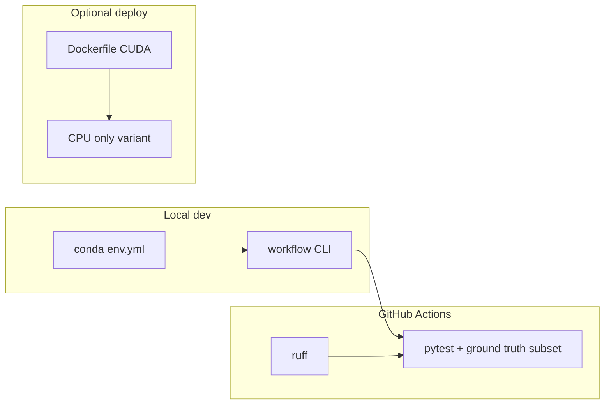

## 8. CI checks (cheminformatics / structural biology)

| Area | Check |
|------|--------|
| Cheminformatics | RDKit SMILES round-trip; salt stripping policy; stereochemistry warnings |
| 2D only | Golden Tanimoto / similarity regression (local or mocked PubChem) |
| Filters | Tier A/B unit tests with fixture responses; ensure docking input builder rejects failed rows; evolved refilter reuses Tier logic and rejects failed evolved SMILES |
| fpocket | Smoke: toy PDB → parsed box with finite extent |
| Structures | Post-PDBFixer backbone sanity; box inside receptor bounds |
| Docking | Deterministic small system (Vina in CI) |
| Ground truth | Curated co-crystal pairs: 2D query returns expected self/CID hit (mocked); redock RMSD ≤ threshold **or** cognate ranks above decoys—same prep/backends as production profile under test |
| Lint | `ruff` + `pytest` |

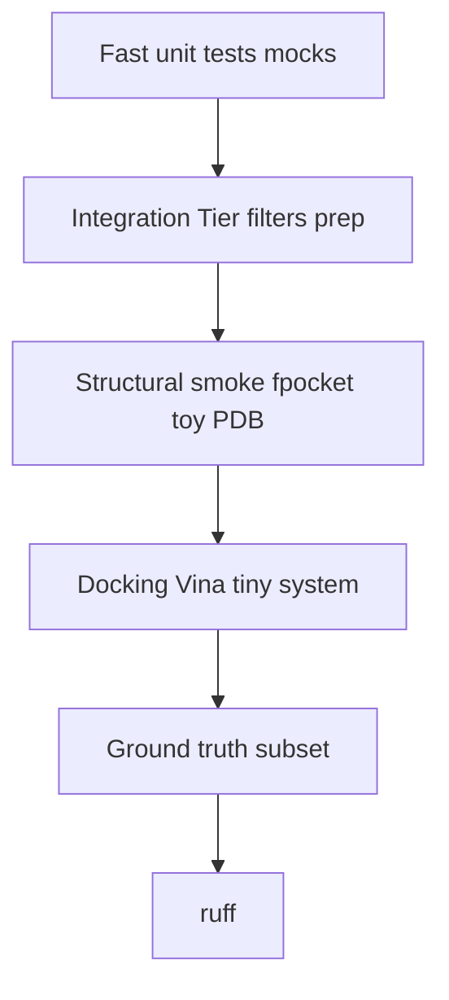

## 9. Ground truth docking assessment (control / regression)

Hold the **similarity** and **docking** stacks accountable with **known ligand–protein pairs** (typically **PDB co-crystals** with documented ligand SMILES or extracted SDF). This does **not** prove herbicide relevance; it **controls** tooling drift, prep bugs, and backend swaps.

**Benchmark manifest** (versioned, e.g. `tests/fixtures/ground_truth/benchmarks.yaml`):

- Per case: receptor identifier (PDB ID + chain or path to mmCIF), **reference ligand** SMILES or SDF, optional **crystal pose** coordinates for RMSD (extract from PDB ligand record or supplied SDF), and **pass criteria** (thresholds as constants in one place).
- Prefer **small, redistributable** structures; document any case that uses **AlphaFold** models instead of experimental coordinates and treat metrics as **weaker** (pose comparison may be unavailable or approximate).

**2D similarity (PubChem) controls**

- For each benchmark ligand, run the **same** PubChem 2D similarity path used in production (endpoint, fingerprint assumptions, canonicalization).
- **Assertions**: e.g. query ligand’s **CID** (or isosteric documented analog) appears in results above a **minimum Tanimoto**; optional **golden response** fixtures for **offline CI** (mocked HTTP) so runs do not depend on PubChem uptime.
- On **config or client changes**, refresh goldens deliberately and review the diff.

**Docking controls**

- Run **production-equivalent** receptor prep, **fpocket** (or, for a **dedicated sub-suite**, an optional **co-crystal box** derived from the ligand’s experimental position to isolate docking engine behavior—document which mode each case uses).
- **Redock** the cognate ligand; compare docked pose to crystal when both are in the same frame: **heavy-atom RMSD** below a documented Å threshold (recognize that **reproducing** crystal poses is hard; thresholds should be **lenient for CI** or use **best-of-seeds**).
- **Alternative / additional**: dock the cognate among a **fixed decoy set** (same prep); require cognate **rank or score** better than a stated bar—useful when RMSD is noisy.

**Outputs and gating**

- Write `validation/ground_truth_report.json` (or under run root when invoked via CLI) with per-case metrics, versions of GNINA/Vina/fpocket/RDKit, and pass/fail.
- Optional CLI: `workflow validate --suite ground_truth` for local or release gating; CI runs a **minimal** subset on **CPU / Vina** with the same code paths where possible.

**Relationship to the main graph**

- Ground-truth runs are **orthogonal** to the LangGraph production DAG: they **reuse** `pubchem`, `ligand_prep`, `receptor_prep`, `fpocket_parse`, and `DockingBackend` modules without requiring Tier A/B or evolution.

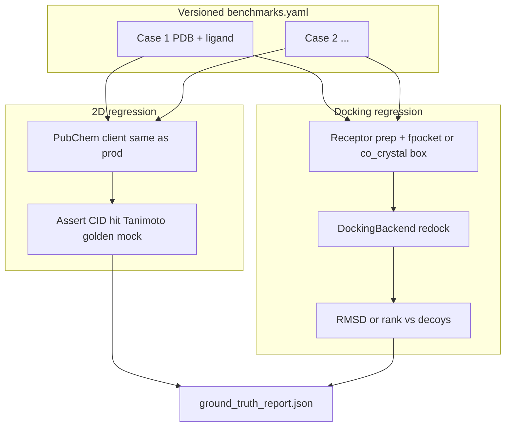

## 10. Repository layout (under `cheminformatics_testing/`)

- `src/workflow/` — graph, config
- `src/workflow/steps/` — pubchem, tier_a, tier_b, dock_pool_cap, ligand_prep, receptor_prep, fpocket_parse, docking_wt, docking_mutant, openmm_mutate, evolution, evolved_refilter (or shared tier module invoked twice)
- `runs/` or configurable **run root** — gitignored; holds **Pipeline artifacts** layout per execution
- `src/workflow/backends/` — gnina, vina
- `src/workflow/reporting/` — optional `plots.py` (or `scripts/plot_run.py`) implementing **Human review plots**
- `notebooks/` — optional `run_review.ipynb` (ignore `outputs/` or committed figures per team policy)
- `tests/fixtures/ground_truth/` — benchmark manifest, optional tiny PDB/mmCIF fragments, golden PubChem JSON, decoy SMILES lists
- `configs/`, `tests/`, `docker/`, `README.md`, `LICENSE`, `THIRD_PARTY_NOTICES.md`

## 11. Suggestions (workflow improvements)

These align with **maximum automation** and **open science** (see **Robustness layers** above for cross-cutting architecture):

1. **Run manifest**: single JSON per run (git commit, conda env hash, all CLI args, random seeds, PubChem/ChEMBL API versions)—enables audit and bug reports.
2. **Idempotent caching**: disk cache for PubChem/ChEMBL/fpocket outputs to resume long runs.
3. **Fail-loud defaults**: ambiguous fpocket or empty hit lists should exit with **clear next steps** (adjust similarity cutoff, relax one Tier B rule in dev profile)—avoid silent partial results.
4. **Sensitivity analysis**: optional `--repeat N` for evolution seeds; report mean/std of best score.
5. **License hygiene**: CI check that dependency metadata lists no proprietary wheels; document **no guarantee** of regulatory acceptance for herbicide claims.
6. **Human gates (rare)**: only when automation cannot proceed—e.g. no pocket, corrupt structure, or user explicitly enables “review export” to inspect PDB+box (off by default).
7. **Auto plots after run** (optional): if `--plots` or config flag set, call reporting helpers at end of successful run so `runs/.../plots/` is populated without opening a notebook.
8. **Resource defaults**: ship **conservative** `max_parallel_docks` and chunk sizes in `configs/example.yaml`; README explains how to scale up without OOMing shared machines.

## 12. Parallel agents (how to launch without clobbering each other)

Multiple AI or human agents should **not** edit the same files concurrently. Use **ownership boundaries** aligned with the repo layout and git mechanics.

### Single shared document (e.g. this plan or one README)

- **One owner at a time**: only one agent edits the plan; others post requests in chat or a scratch file.
- **Or append-only**: agents add bullets under their signed subsection (`### Agent A — date`) instead of rewriting each other’s paragraphs.
- **Or branch-per-agent**: each agent works on `agent/<name>/plan-notes.md` and a human merges once.

### Codebase (recommended for implementation)

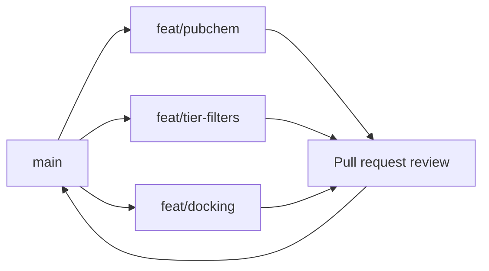

1. **Branch per agent**: `feat/pubchem`, `feat/tier-filters`, `feat/docking`, etc. Merge via PR; never two agents on `main` editing the same paths.
2. **Git worktrees** (optional): clone the same repo into multiple directories, one worktree per agent/branch, so each Cursor window has an isolated working tree—eliminates accidental overwrite of uncommitted files across windows.
3. **File ownership map** (keep in-repo as `AGENTS.md` or `docs/OWNERS.md` when you start coding):

   | Agent / stream | Owns (primary) | Touches only with care |
   |----------------|----------------|-------------------------|
   | A | `src/workflow/steps/pubchem*`, `tests/test_pubchem*` | shared `config` models |
   | B | `tier_a`, `tier_b`, filter tests | `schemas` / shared types |
   | C | `ligand_prep`, `receptor_prep`, `fpocket_parse`, `dock_pool_cap` | `backends` |
   | D | `backends/vina`, `backends/gnina`, `docking_wt`, `docking_mutant` | CLI flags |
   | E | `openmm_mutate` | prep outputs |
   | F | `evolution`, evolved refilter wiring, LangGraph graph | docking interface, tier modules |
   | G | `docker/`, `environment.yml`, CI | — |
   | H | `tests/fixtures/ground_truth/`, `tests/test_ground_truth*`, validation report schema | shared docking/pubchem modules |
   | I | `src/workflow/reporting/`, plot CLI, `notebooks/run_review*` | artifact schemas |

   Adjust columns to match actual split; the rule is **one primary owner per package**.

4. **Integration agent or human** for `pyproject.toml`, root `README`, and `src/workflow/graph.py`—or sequence agents: scaffold first (single agent), then parallel leaf modules, then one agent wires the graph.

5. **No shared mutable scratch in VCS**: use `.gitignore`d `scratch/` or agent-local notes outside the repo if needed.

6. **Lock communication**: a short `docs/status.md` or GitHub **Project** columns (“In progress: pubchem — Alice”) updated when an agent starts/finishes, to avoid two agents picking the same todo.

### Cursor-specific habit

Give each agent a **narrow prompt**: explicit paths to create/change, explicit paths **forbidden**, and “do not edit `graph.py`” unless that agent owns integration. That reduces overlap more than generic “implement the workflow.”

## 13. Risks and non-goals

- Filters and docking scores are **ranking aids**, not registration data.
- OpenMM minimization + rigid/semi-flexible docking is **not** binding free energy.
- **Ground-truth** benchmarks **regress the pipeline**, not biological truth for new chemistries; failing a benchmark means “fix tooling or thresholds,” not necessarily “wrong science.”
- **RAM / OOM**: misconfigured **parallel docking** or **loading entire hit tables** can still kill the host; defaults must favor **stability over peak throughput**—users opt in to aggression.
- Rate limits: batch and cache external APIs.

## Implementation order

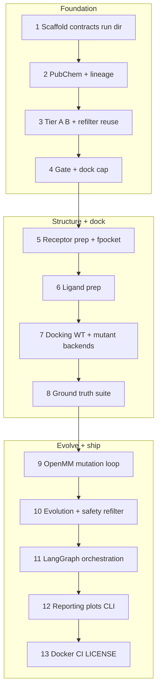

1. Scaffold in `cheminformatics_testing` + config models + CLI + **step contracts** (Pydantic) + **run directory** and **artifact writers** (named files per **Pipeline artifacts**) + **resource** section in config (`max_parallel_docks`, HTTP concurrency, chunk sizes) with conservative defaults.  
2. PubChem 2D client + merge/dedupe hits + **canonical SMILES** + lineage table.  
3. Tier A + Tier B modules + provenance schema + tests (callable from both initial and **evolved** refilter paths).  
4. Gate + **dock pool cap** (`max_compounds_to_dock` **xor** `top_n_by_2d_score`) + persisted `dock_pool` artifact.  
5. Receptor prep (PDBFixer + Open Babel) + fpocket wrapper + box parser.  
6. Ligand prep (RDKit + Open Babel) **for docking input only**.  
7. Docking backends; **WT** pass + **mutant** pass wiring; filter-gated inputs + chosen cap.  
8. **Ground-truth suite** (§9): benchmark manifest, 2D + docking regression tests, `validation/ground_truth_report.json`, wire into CI.  
9. OpenMM mutation + minimize + mutant docking + Δ vs WT table.  
10. Robust pocket-aware evolution loop + **mandatory Tier A+B refilter** before re-prep/re-dock.  
11. LangGraph orchestration enforcing order + **checkpoints** + structured logging + subprocess runner.  
12. **Reporting** module + optional `workflow plot` / `--plots` + `summary.json` funnel keys aligned with plot helpers.  
13. Docker, LICENSE, notices, GitHub Actions.
